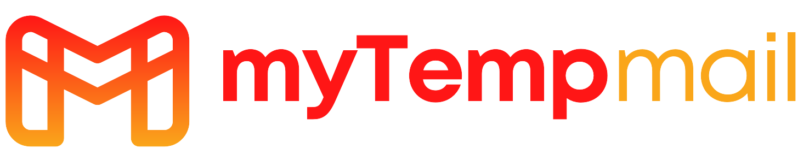

# MyTempMail



A modern web application that allows users to generate temporary email addresses using Gmail's plus addressing feature. Create unlimited disposable email addresses that forward to your main Gmail inbox.

## 🚀 Features

- **Email Generation**: Create up to 10 temporary email addresses at once
- **Copy Functionality**: Easily copy individual emails or all emails at once
- **Responsive Design**: Works seamlessly on desktop and mobile devices
- **Dark/Light Mode**: Choose your preferred theme
- **Privacy-Focused**: All processing happens in the browser, no data is stored on servers
- **Interactive UI**: Smooth animations and intuitive interface
- **Accessibility**: Fully accessible with keyboard navigation and screen reader support

## 📋 How It Works

MyTempMail leverages Gmail's "plus addressing" feature. When you add a plus sign (+) followed by any text to your Gmail username, messages sent to that address will still be delivered to your inbox.

For example:

- Your email: `youremail@gmail.com`
- Temporary email: `youremail+anything@gmail.com`

This allows you to:

- Track which services are selling your email address
- Create disposable emails for sign-ups
- Filter emails with custom inbox rules
- Protect your privacy online

## 🛠️ Technologies Used

- **Next.js 14**: React framework with App Router
- **TypeScript**: For type-safe code
- **Tailwind CSS**: For styling and responsive design
- **shadcn/ui**: Component library for consistent UI elements
- **Framer Motion**: For smooth animations and transitions
- **Radix UI**: For accessible UI primitives
- **next-themes**: For theme management (dark/light mode)
- **Geist Font**: Modern, clean typography

## 🔧 Installation

1. Clone the repository:
   ```bash
   git clone https://github.com/khadka27/my-temp-mail.git
   ```

## Install dependencies:

```bash
npm install
```

## Run the development server:

```bash
npm run dev
OR
pnpm dev
```

### Open http://localhost:3000 in your browser to see the app.

# 🌐 Live Demo


## Check out the live version here: https://mytempmail.vercel.app


📄 License
This project is licensed under the MIT License.

Built with ❤️ by Abishek Khadka (khadka27)
